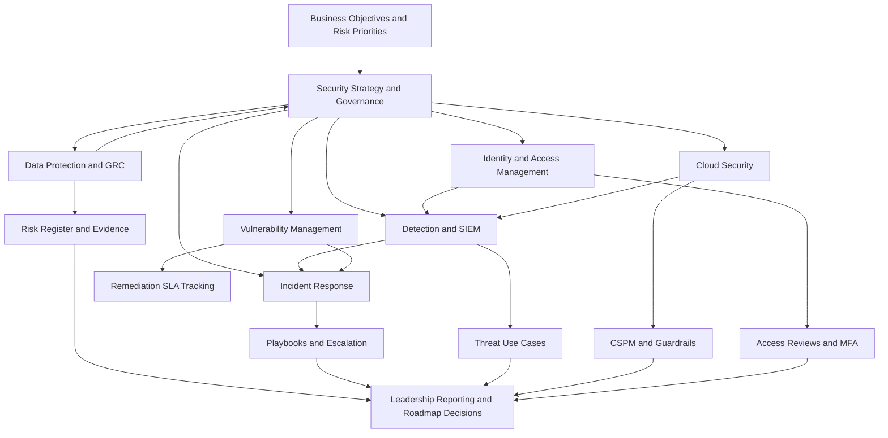

# Security Capability Diagram

## Purpose

This diagram shows how security strategy connects business risk, governance, and operational capabilities. It is intended to support roadmap discussions and explain capability relationships to technical and non-technical stakeholders.
