# Operating Model Workflow

```mermaid
flowchart LR
    A[Identify capability gap or risk theme] --> B[Assess current state and maturity]
    B --> C[Map risk and threat relevance]
    C --> D[Define target-state capability]
    D --> E[Assign owner, dependency, and sequence]
    E --> F[Add initiative to strategic roadmap]
    F --> G[Implement through operational teams]
    G --> H[Measure KPI and control outcomes]
    H --> I[Report to leadership and adjust roadmap]
```

## Workflow Purpose

This workflow shows how a capability issue moves from strategic analysis into operational execution and leadership reporting. It supports the transition from assessment to governance, implementation, measurement, and continuous roadmap refinement.

## Stakeholders

- Security Strategy
- SOC
- Cloud Security
- IT Operations
- GRC
- Leadership
